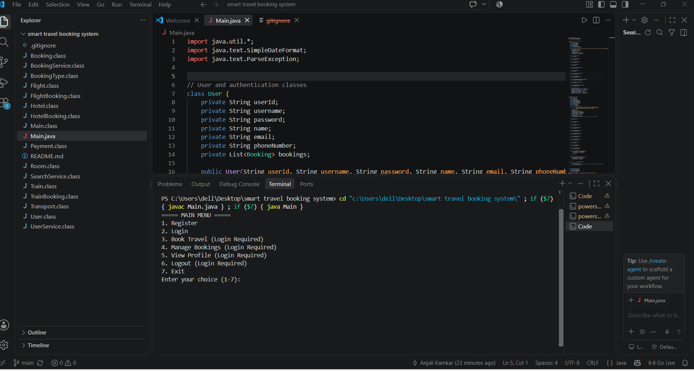

# ✈️ Smart Travel Booking System

A Java console-based travel booking application designed to
simulate real-world travel booking operations including flights,
trains, hotels, bookings, cancellations, and payments.

## 🛠️ Technologies

Java • OOP • Collections • Exception Handling • Date & Time
## Application Preview

